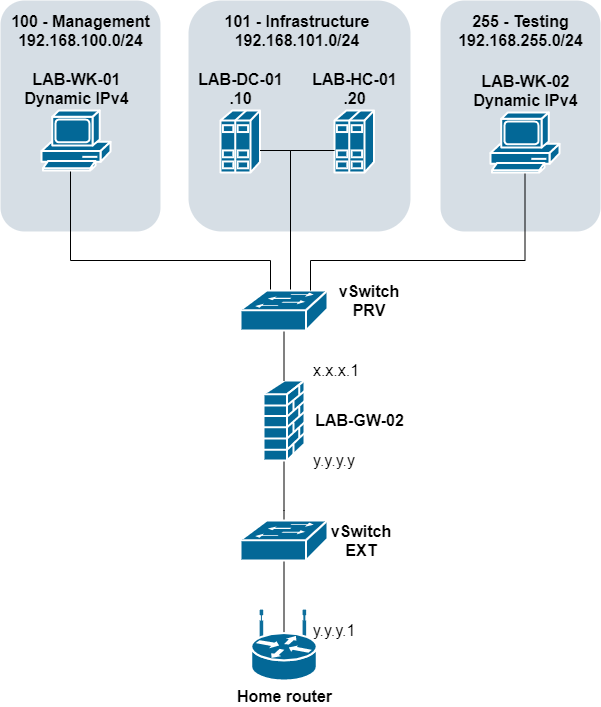

# Homelab
Documentation of my homelab setup and learning progress

# Table of contents
* [Goal](#goal)
* [Hardware](#Hardware)
* [Software](#Software)
    * [Management and documentation tools](#Management-and-documentation-tools)
    * [Hypervisor](#Hypervisor)
    * [Microsoft servers](#Microsoft-servers)
    * [Firewall appliance](#Firewall-appliance)
    * [Linux](#Linux)
* [Network](#Network)
    * [vSwitches](#vSwitches-(Hyper-V))
    * [VLANs and subnets](#VLANs-and-subnets)
    * [Diagram](#Diagram)
* [VMs](#VMs)
* [Future considerations](#Future-considerations)

# Goal
1. Create a base environment for testing and learning about IT systems
2. Continue exploring

# Hardware
So far I've only been using my main [i5-8600K](https://ark.intel.com/content/www/us/en/ark/products/129937/intel-core-i5-8600-processor-9m-cache-up-to-4-30-ghz.html) based PC to host all the VMs

# Software
## Management and documentation tools
* [KeePass 2](https://keepass.info/) password manager
* [Royal TS Lite](royalapps.com/ts) remote connection manager (SSH, RDP, VNC and more)
* [draw.io](draw.io) diagram making
* [github.com](github.com) source code/documentation version control

## Hypervisor
* [Windows 10 Education](https://www.microsoft.com/en-us/windowsforbusiness/compare) (which is [basically Enterprise edition with disabled ads](https://docs.microsoft.com/en-us/education/windows/windows-editions-for-education-customers#windows-10-education)) with Hyper-V feature installed

## Microsoft servers
* [Windows Server 2016](https://docs.microsoft.com/en-us/windows-server/get-started/server-basics) Datacenter with various roles:
    * Active Directory Domain Services
    * DNS Server
    * DHCP Server
    * Remote Desktop Services

## Firewall appliance
* [pfSense](https://www.pfsense.org)
* [Sophos XG Home Edition](https://www.sophos.com/en-us/support/documentation/sophos-xg-firewall.aspx)

## Linux
* [CentOS 8](https://www.centos.org/)
* [Ubuntu Server 20.04 LTS](https://ubuntu.com/download/server)

# Network

## vSwitches (Hyper-V)
* EXT
    * bridged to hardware NIC of the host computer
    * connected only to the main gateway server as a WAN zone
* PRV
    * connected to every VM in the homelab as LAN adapter
    * have IEEE 802.1Q tagging enabled
    * connected to main gateway with a trunk link allowing all VLAN IDs, other hosts are connected via access links to a single VLAN per NIC

Managing HyperV virtual switches and VLANs

Since setting trunk mode is not possible via Hyper-V GUI (at least not via Windows 10 feature version) the powershell cmdlets come to use: 
<a href="https://docs.microsoft.com/en-us/powershell/module/hyper-v/add-vmswitch?view=win10-ps">Add-VMSwitch</a> 
<a href="https://docs.microsoft.com/en-us/powershell/module/hyper-v/add-vmnetworkadapter?view=win10-ps">Add-VMNetworkAdapter</a> 
<a href="https://docs.microsoft.com/en-us/powershell/module/hyper-v/set-vmnetworkadaptervlan?view=win10-ps">Set-VMNetworkAdapterVlan</a> 
I.e. setting the LAN adapter for gateway VM to trunk and allowing VLAN 100 and 101 on it  
<code>Set-VMNetworkAdapterVlan -VMName LAB-GW-01 -VMNetworkAdapterName "LAN" -Trunk -AllowedVlanIdList {100,101} -NativeVlanId 0</code> 
Note that modyfying this adapter via GUI will override those setings.

## VLANs and subnets
* 0100-Management
    * VID - 100
    * IPv4 - 192.168.100.0/24
    * FW policies - allow SSH, RDP, HTTP(S) traffic to all other VLANs
    * Description - hosts accessing management interfaces of other servers
* 0101-Infrastructure
    * VID - 101
    * IPv4 - 192.168.101.0/24
    * FW policies - allow DNS, DHCP, LDAP services to be accessible from all other VLANs
    * Description - core infrastructure servers for the homelab
* 0255-Testing
    * VID - 255
    * IPv4 - 192.168.255.0/24
    * FW policies - ad-hoc policies for testing, no intervlan traffic allowed, only for outcoming external traffic
    * Description - ad-hoc testing

All hosts other then the lab gateway itself are only connected to virtual network (PRV), so all external (and also intervlan) traffic comes through the gateway.

By default all traffic is denied, only allowing for specific traffic based on the network subnet purpose.\

## Diagram

Click to see the network diagram

# VMs
* LAB-GW-02 - main gateway
    * Sophos XG Firewall Home Edition
    * 1 vCPU
    * 4GB RAM
    * 16GB + 80GB storage
    * 1 NIC connected to EXT vSwitch - WAN zone - static IP in home network range
    * 1 NIC in trunk mode (all VLANs) connected to PRV vSwitch - LAN zone
* LAB-DC-01 - primary AD controler and DNS server
    * Windows Server 2016 Datacenter
    * 1 vCPU
    * 4GB RAM
    * 50GB storage
    * 1 NIC - static IPv4 192.168.101.10
    * AD + DNS roles for homelab.local domain
* LAB-HC-01 - DHCP server
    * Windows Server 2016 Datacenter
    * 1 vCPU
    * 4GB RAM
    * 50GB storage
    * 1 NIC - static IPv4 192.168.101.20
    * DHCP role
* LAB-WK-01 - management host
    * Windows 10
    * 1vCPU
    * 2GB RAM
    * 40GB storage
    * 1 NIC - dynamic IP from 192.168.100.0/24 assigned by DHCP relay
* LAB-WK-02 - testing hosts - learning about linux and testing various configurations before implementing them in "production" (in terms of the homelab)
    * Ubuntu server 20.04 LTS
    * 1vCPU
    * 2GB RAM
    * 10GB storage
    * 1 NIC - dynamic IP from 192.168.255.0/24 assigned by DHCP relay
* ~~LAB-GW-01 - pfSense - main gateway~~ depreciated

# Future-considerations

Systems to implement:
* [x] Gateway/FW (pfSense, replaced by Sophos XG)
* [x] DC + DNS
* [x] DHCP
* [ ] Syslog (Graylog)
* [ ] Monitoring (Zabbix>Nagios)
* [ ] File server (WinSrv>Linux)
* [ ] Backup server (?)
* [ ] WSUS
* [ ] FTP (?)
* [ ] Automated OS deployment (MDT, ?)
* [ ] Centralized endpoint management (ME Desktop Central, ?)
* [ ] Webserver (hosting mediawiki)
* [ ] more

Improvements:
* [ ] Implement dedicated management network interfaces for all servers and remove the rule allowing traffic from 0100-ManagementNetwork to other networks
* [ ] Clean up this doc